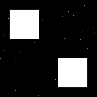
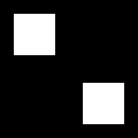
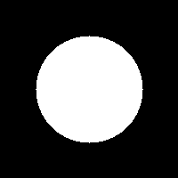

# Reconstrução Morfológica em Níveis de Cinza

### Visão Geral
Neste projeto, colocamos a mão na massa para mostrar como funciona a **reconstrução morfológica** em imagens de tons de cinza. Tudo foi feito com Python puro: NumPy para mexer nos pixels e Pillow para salvar as figuras.

### Por que morfologia?
Morfologia é o que usamos para tratar a forma dos objetos numa imagem. Aqui, focamos em dois desafios comuns:

1. **Remover ruído**: eliminamos pontinhos isolados, mas mantemos as estruturas principais intactas.
2. **Preencher buracos**: lacunas internas dos objetos são fechadas, deixando-os sólidos.

### Como funciona
1. **Marcador e máscara**: você aponta onde quer agir (marcador) e define até onde a ação vale (máscara).
2. **Operador geodésico**: aplicamos erosão ou dilatação e, em seguida, consertamos os resultados para não ultrapassar a máscara.
3. **Iteração**: repetimos até não mudar nada e pronto, temos o resultado final.

### Estrutura do código
- **main.py**: script único que gera as imagens de teste, aplica os métodos e salva tudo em `outputs/`.
- **Funções**:
  - `dilate()`, `erode()`: dilatação e erosão manuais.
  - `morphological_reconstruction()`: dilatação geodésica iterativa.
  - `remove_small_objects()`, `fill_holes()`: casos de uso.

### Exemplos
| Caso                  | Antes                                    | Depois                                   |
|-----------------------|------------------------------------------|------------------------------------------|
| Remoção de ruído      |  |    |
| Preenchimento de buracos |  |    |

### Como usar
1. Instale as dependências:
   ```bash
   pip install numpy pillow
   ```
2. Rode o script:
   ```bash
   python main.py
   ```
3. Confira os resultad
**Equipe**os em `outputs/`.

---
- Alex Sandro Antonio de Oliveira (22112015)
- Jaiane Souza Oliveira (22112369)
